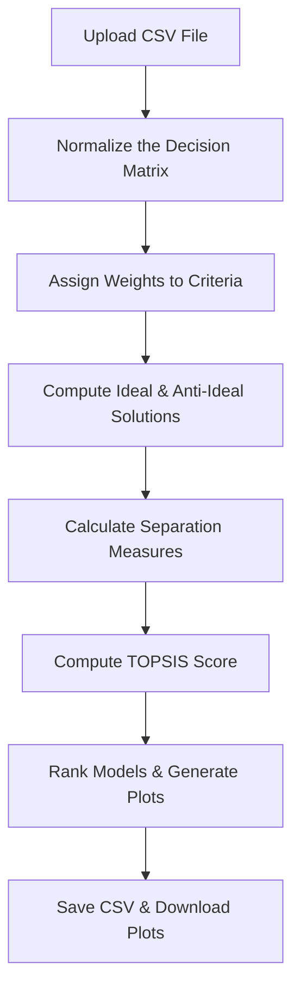
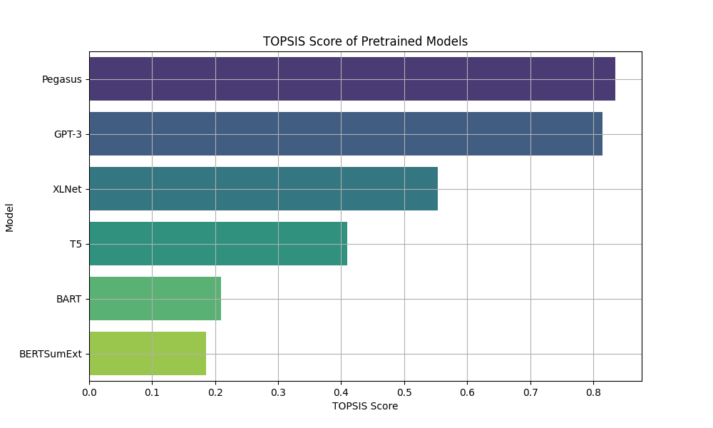
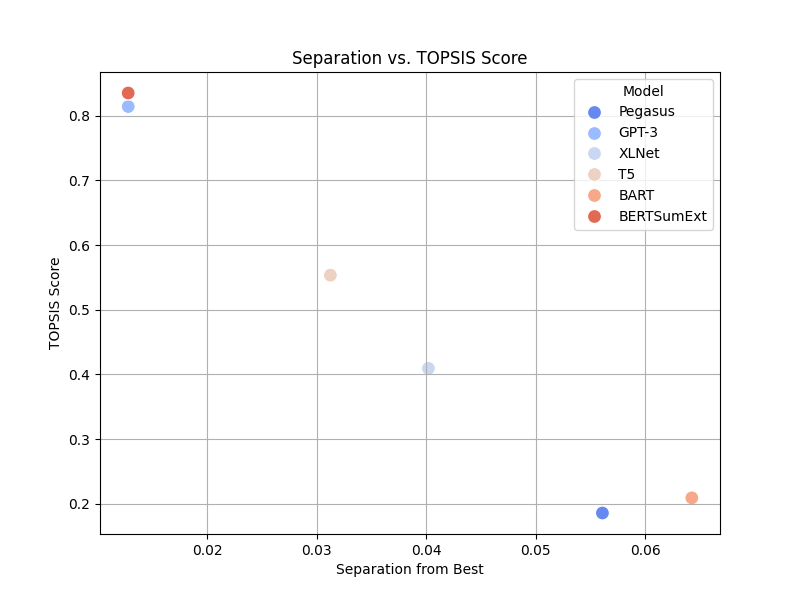
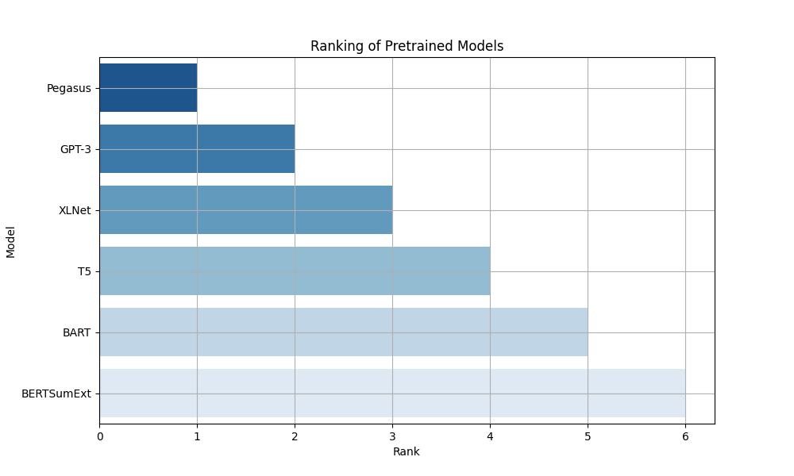

# **TOPSIS for Pretrained Models**  

  
  
  

## **📌 Overview**  
This project applies the **TOPSIS (Technique for Order of Preference by Similarity to Ideal Solution)** method to evaluate and rank **pretrained models** based on multiple performance metrics such as **accuracy, inference time, F1-score, etc.**.

It is **Colab-compatible**, generates **ranked outputs**, and provides **beautiful visualizations** of model performance.

---

## **🚀 Features**  
✅ **Automated Model Ranking** – Computes TOPSIS scores and sorts models.  
✅ **Customizable Metrics** – Works with accuracy, inference time, F1-score, etc.  
✅ **Visualizations** – Generates **bar charts, scatter plots, and ranking plots**.  
✅ **Google Colab Compatible** – Upload a CSV, run the code, get results.  
✅ **Auto-Download** – Saves results as CSV and plots as PNG images.  

---

## **📂 Dataset Format**  
Prepare a CSV file with the following structure:
```csv
Model, Accuracy, Inference Time, F1-Score
ResNet50, 0.92, 0.12, 0.90
BERT, 0.88, 0.20, 0.89
GPT-3, 0.95, 0.30, 0.93
```
👉 The first column should contain model names, and the following columns should contain numerical performance metrics.

---

## **🛠️ How TOPSIS Works**  
TOPSIS ranks alternatives based on their closeness to the **ideal solution (best values)** and distance from the **worst solution (worst values).**

### **🔄 Flowchart**


---

## **📊 Visualizations**  
The script generates the following plots:
### **1️⃣ TOPSIS Score Bar Chart**
📊 **Shows the ranking of pretrained models.**

### **2️⃣ Separation vs. Score Scatter Plot**
📈 **Visualizes the separation distance from best/worst solutions.**

### **3️⃣ Model Ranking Chart**
🏆 **Displays final model rankings.**

---

## **💻 Installation & Usage**  
Run the script in **Google Colab** or a Python environment:
```bash
!pip install numpy pandas matplotlib seaborn
```

### **⚡ Running the Code**  
1️⃣ Upload your dataset (`models_performance.csv`).  
2️⃣ Run the Python script.  
3️⃣ Download the ranked CSV file & plots.  

---

## **📥 Example Output**  
### **🔹 TOPSIS Score Bar Chart**  


### **🔹 Separation vs. TOPSIS Score**  


### **🔹 Model Ranking**  


---
